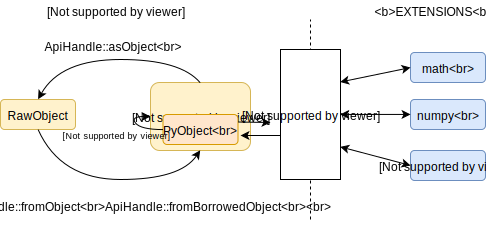

# The C-API

The Python community has created an extensive set of modules written in C/C++,
which can be imported from any Python code. By using [CPython's
C-API](https://docs.python.org/3/c-api/intro.html), these extension modules can
access the interpreter and interact with managed objects from C/C++.

Many core built-in modules are written in C as an extension.
[Cython](https://cython.org/) - a popular way of speeding up Python code -
relies on C-API as well, so C-API support in Skybison Runtime is an essential
feature.

> NOTE: This document was written during early project planning stages. Parts
> of it may be out of date.

## Reimplementation strategy

What needs to be reimplemented? All functions that access object internals
directly - functions that dereference a `PyXyzObject` object and read out a
member or take the address of a member. For example, `PyLong_FromLong` directly
accesses `PyLongObject`'s member  `ob_digit`. Given that `PyLongObject` is not
a valid struct in the Runtime, this function will have to be rewritten.

The implementation of C-API functions is in `Python/` and `Objects/`
directories in the CPython repo. We plan to reuse a subset of this code. Since
C-API is fairly stable, our current plan is to just copy the implementation of
safe functions into our sources.

One goal of the C-API reimplementation is to be able to reuse all native code
in the `Modules/` directory (built-in modules) with no source-level changes
(with rare exceptions of misbehaving code).

## History & Issues

C-API has been developed over the course of decades. The biggest issue is that
it's not separated from CPython runtime and it exposes many implementation
details.

When you create an extension, you include `"Python.h"`, which transitively
includes basically all CPython headers. Public CAPI functions typically start
with `Py_` (like `PyLong_FromLong`), while private functions start with `_Py_`
(like `_Py_NewReference`). But this is only a naming convention, extensions can
technically use the private functions as well. This convention is also not
followed in 100% of cases - `_PyObject_New` can be find in the docs as a public
C-API function, for example.

We will unfortunately **not be able to support all public C-APIs** - in some
cases even the interface relies on some implementation details. This is a known
problem and we will need to migrate code using affected APIs (like the
`PyTypeObject` APIs) to newer APIs (sometimes known as the Limited API) that
enforce data-hiding. See
[compatible-c-extensions.md](compatible-c-extensions.md).

PyPy has not supported C-API in the beginning. It is now provided by the
"CPyExt" subsystem. Check out this great article on the PyPy blog: [Why
emulating CPython C API is so
Hard](https://morepypy.blogspot.com/2018/09/inside-cpyext-why-emulating-cpython-c.html).

Here is a comprehensive summary of some other problems of current C-API design
and some proposal on how to fix them: [Design a new better C API for
Python](https://pythoncapi.readthedocs.io/).

Recently, [HPy](https://github.com/hpyproject/hpy) has made excellent progress
toward a better C-API.

## PyObject* vs RawObject

CPython represents all objects as `PyObject*` - pointers to a common base
structure that has some basic fields like *type* and *reference count*. When an
object is created, CPython just allocates an object of the right size on the
heap - and the address never changes during the object lifetime.

This is the first and the most important problem we need to overcome. In
Skybison Runtime, objects don't have to be allocated on the heap (immediate
objects) and even heap-allocated objects can change the location during their
lifetime because of a compacting GC.

All C-API functions and extensions work with `PyObject*` and can make the
assumption that the object doesn't move. To support this, we allocate a special
object on the heap for every object that needs to cross the boundary between
Runtime and an extension module:

```
struct PyObject {
  RawObject reference;  // corresponding object
  long ob_refcnt;
}
```

In Runtime code, we wrap this object in a special class, `ApiHandle`, which
provides some convenience functions:



Converting PyObject to RawObject is simple - we simply follow the `reference`
pointer at the top of the structure. Converting RawObject to PyObject is not as
straightforward. Runtime keeps a special table for this purpose
(`Runtime::apiHandles`) - it maps RawObjects to ApiHandles.

This table is also important for the GC. If an extension keeps a reference an
object, we can't delete the object even if there are no references to it in the
runtime. For this reason, the garbage collector treats all objects in this
table (with non-zero reference count) as roots.

How does this work for immediate types? PyObject is allocated on heap as usual
and it contains the full RawObject. It's also added to the ApiHandles
dictionary, which means that if you call `PyUnicode_FromString("short")` two
times, you will get the same value (unlike with CPython).

## Reference counting and borrowed references

CPython uses a combination of reference counting and generational GC for memory
management. As you see above, every `PyObject*` has a `ob_refcnt` field. All
functions - including C/C++ extensions using C-API - need to update the
reference count properly. This is typically done via `Py_INCREF` and
`Py_DECREF` macros.

To simplify reference count management, *reference ownership* is used in the
C-API documentation. *"Owning a reference"* means being responsible for calling
`Py_DECREF` on it when it's no longer needed. [See CPython
docs](https://docs.python.org/3/c-api/intro.html#reference-counts) for details.

* Functions returning `PyObject*` return **new references** by default - this
  means the caller is the owner of the reference and has to call `Py_DECREF` or
  transfer the ownership. The other option is returning a **borrowed
  references** - see `PyList_GetItem` for example.
* Functions taking `PyObject*` as an argument don't **steal ownership** of the
  reference by default. A few function do - like `PyList_SetItem` - in which
  case the caller is no longer responsible for decrementing reference count
  when it's no longer needed.

If a function returns a borrowed reference, or if it steals a reference to an
argument, it's always clearly specified in the docs. CPython also provides a
file with details on how different functions affect reference count:
`Doc/data/refcounts.dat` (but note that it's not completely up to date).
