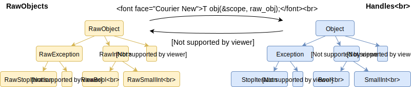

# Object and handles

> NOTE: This document was written during early project planning stages. Parts
> of it may be out of date.

## Common patterns: runtime, thread, handles

You can find this pattern in many places in the codebase:

```cpp
Thread* thread = Thread::current()
Runtime* runtime = thread->runtime();
```

This is a common way to get a pointer to `Runtime`. Every thread keeps a
pointer to its `Thread` object in a thread-local variable, which can be
accessed by `Thread::current()`. Many functions - and almost all `Runtime`
functions -  take a pointer to `Thread` as the first argument to eliminate the
overhead of getting the pointer from TLS, which can be non-negligible with
dynamic linking.

Code like this is likely to follow next:

```cpp
HandleScope scope(thread);
Object obj(&scope, someFunctionReturningRawObject());
```

`RawObject` should not be stored directly on the stack (the only exception is
when you are sure the object has an immediate representation, like
`RawSmallInt` or `RawBool`). You need to put it in a wrapper object called a
"handle" - in this case it's `Object`, but it could be a more specific type
like `Int`. This is needed for the garbage collector to work - `HandleScope`
allows us to enumerate all live handles for tracing, modifying them if
necessary due to the GC moving objects around.

Unlike `RawObjects`, handles can only be **stored on the stack**. Every
`HandleScope` holds a linked list that allows it to traverse all of its
handles, in order from most to least recently constructed. Each `Thread` keeps
a list of active `HandleScope`s, allowing it to easily discover all existing
handles - exactly what's needed by the garbage collector.

## Object and Handle hierarchy

The C++ classes for our objects and handles are currently undergoing a
migration from their initial design to the desired long-term state, details of
which can be found in T34683229. That task describes the end-state in terms of
the old design, so parts of it may or may not make sense depending on when
you're joining us.

When the migration is done, for every built-in object type `Foo`, there will be
two classes:

* `RawFoo`, which contains static data members describing the class's memory
  layout.
* `Foo`, the corresponding handle class described in the previous section.
  Functionality like member getters and setters should live on the handle
  class, making it very difficult to write GC-unsafe code. The vast majority of
  interactions with a Python object should be done through one of these handle
  classes.

The handle classes will have inheritance relationships matching the Python
types they represent, so `StopIteration` will inherit from `Exception`, `Bool`
will inherit from `Int`, etc. Types like `SmallInt` and `SmallStr` that are not
visible to Python code will also be part of this hierarchy, and will inherit
from the type they appear as in Python code (`Int` and `Str`, respectively).



Since this migration is in progress, the current state of the codebase is not
yet as described above. It is fairly close, and for the most part, you should
be able to write code that uses the object types and their corresponding
handles as though the migration is finished. The key differences (as of
2018-11-07) are:

* The handle classes `Int`, `Str`, etc., are aliases for a `Handle<T>` class
  template, rather than proper classes. The external API of `Handle<T>` is as
  close to the final state as possible.
* `Handle<T>` inherits from `T` to allow access to all static members of
  `RawFoo` directly from `Foo`.
* All getters, setters, and other member functions for the built-in types are
  still members of the `Raw*` types, rather than the handle classes. Member
  functions can be called `.` on the handle, due to the
  inheritance mentioned in the previous bullet.
